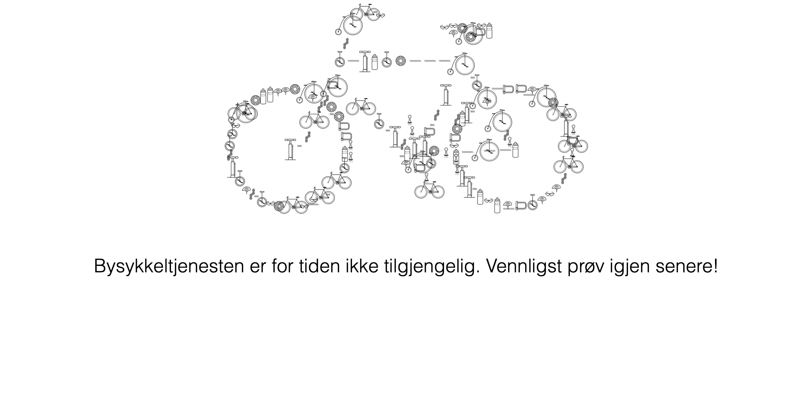

# Demo

En fungerende demonstrasjon av løsningen finnes her: [http://bysykkel-origo.skeiene.no](http://bysykkel-origo.skeiene.no).

# Bysykkel

Denne webapplikasjonen er en enkel applikasjon som gjør det mulig å se alle bysykkel stasjonene med antall ledige sykler og parkeringsplasser/låser. Brukeren har mulighet til å søke (filtrere) ved å skrive inn navnet på en stasjon i filterings-feltet på toppen av siden. Søket tar ikke hensyn til store og små bokstaver, og søkesetningen søker i hele ordet (ikke kun fra begynnelsen).

For å se hvor stasjonene befinner seg, er det mulig å åpne en liten kartvisning som bruker Open Street Map. Fra kartet kan man også velge å åpne kartet i et eget vindu.

Under filtrerings-feltet til høyre vises det hvor mange av det totale antallet bysykkel stasjoner som vises

Videoen under viser applikasjonen i bruk:

Dersom noe går galt med henting av bysykkeldata, returnerer APIet en 500-feilkode til webapplikasjonen. Webapplikasjonen viser i så tilfelle en egen feilmeldingsside i stedet for stasjonssøket.

# Implementasjon

Nettsiden er utviklet med SvelteKit. En ServerSide Rendered versjon er bygget via `npm run build` og deployet til en server med NGINX. 

Svelte har en intuitiv uviklingsmodell som gjør det raskt å bygge selv komplekse nettsiden. I denne applikasjonen er det noen filer som er sentrale: 

- All kildekode ligger i src-mappen
- src/routes inneholder alle URL-endepunktene til applikasjonen
- I src/lib ligger globale komponenter og Svelte Stores (for å holde på og hente data via XHR)
- src/lib/stores/bysykkelStore.js har ansvaret for å hente data fra APIene og sammenstille disse til en enhetslig JSON-struktur for bruk videre i applikasjonen
- src/lib/Stasjon.svelte er en komponent som har ansvaret for å vise en enkelt stasjon
- src/routes/__layout.svelte er hoved-layout-filen til applikasjonen og plasserer topp-grafikken på siden(e)
- src/routes/index.svelte Dette er index-siden til applikasjonen og viser filtrerings-input-feltet og alle Stasjon-komponentene
- src/routes/error.svelte er feilmeldings-siden som vises dersom data ikke kan hentes fra APIet

### Grafikk

Alle grafikk-filer brukt i denne applikasjonen er hentet Pixabay.

### Bygging

Etter at koden er lastet ned for første gang, må man kjøre `npm install`. 

For å bygge frontent koden kan man velge å starte i "utviklingsmodus" via `npm run dev`, eller generere SSR-versjonen via `npm run build`. Dersom man starter utviklingsmodusen kan nettsiden nås via http://localhost:3000.

### Ferdig bygget
I dette repositoryet er den ferdig-bygde SSR-versjonen av web-applikasjonen lagt ved allerede i build-mappen. Dette er gjordt for å gjøre det litt enklere å få applikasjonen opp. Normalt ville build-mappen ligget i .gitignore. 
